# 👨🏽 Bondoman

Bandung Bondowoso merupakan seorang kepala proyek pembangunan seribu candi. Proyek tersebut dia dapatkan dari Roro yang tidak memahami segitiga manajemen proyek, yaitu budget, deadline, dan quality. Proyek ini memiliki budget yang sedikit, deadline yang hanya satu malam, dan Roro meminta kualitas candi yang bagus.

Bondowoso merasa pusing ketika mengerjakan proyek seribu candi dalam satu malam ini. Dalam pengerjaannya, terjadi banyak sekali transaksi pembelian bahan baku. Tentu saja dia harus berhati-hati dalam melakukan perhitungan biaya, sebab jika tidak seusai dengan RAB (Rancangan Anggaran Biaya) semula, Roro tidak ingin membayarnya. 

Awalnya, Bondowoso menuliskan segala transaksi jual beli bahan baku di atas prasasti berbentuk batu. Namun, dengan skala proyek yang sangat besar ini, ia kewalahan dan meminta bantuan kalian, para jin yang saat ini berkuliah di Institut Jin semester 6, untuk membuat aplikasi manajemen keuangan. Ia percaya kalian bukanlah jin yang pandir sehingga dapat menyelesaikan aplikasi tersebut.

Saat ini, Bondowoso menginginkan aplikasi tersebut dapat berjalan di gawai yang ia miliki. Karena ia tidak suka buah apel, ia meminta aplikasi dibuat untuk sistem operasi Android. Bantulan Bondowoso memanajemen uangnya agar pembangunan candi berjalan lancar!

## ⚡ Main Features

| Feature            | Screenshot                                                                                                                                   |
|--------------------|----------------------------------------------------------------------------------------------------------------------------------------------|
| Login              | 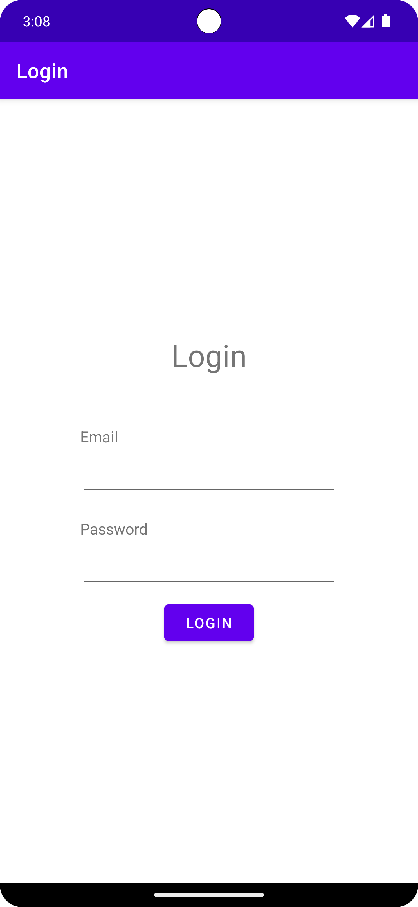                                                                                  |
| Transaction List   | 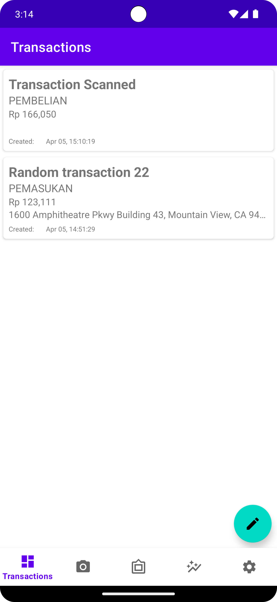                                                                       |
| Add Transaction    | 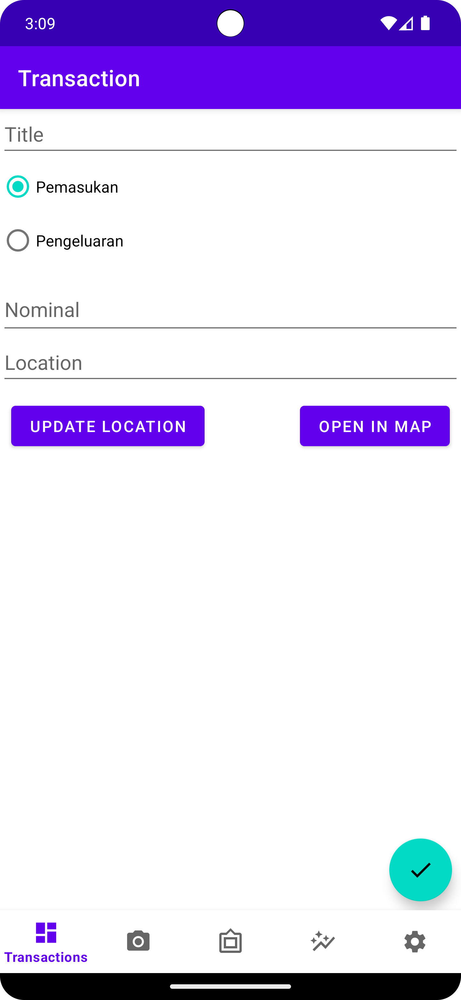                                                                   |
| Update Transaction | 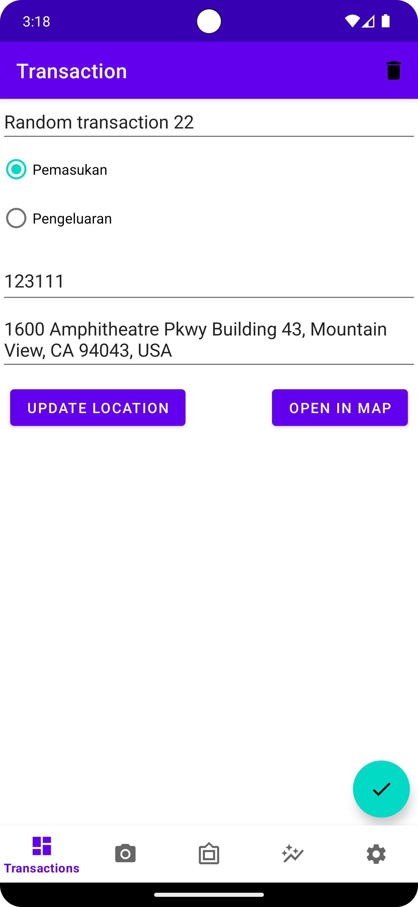                                                                    | 
| Scan               | 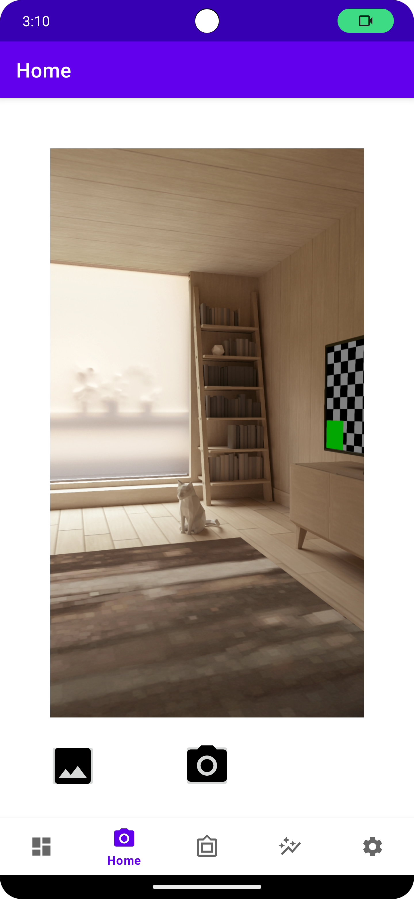                                                                                   |
| Scan Result        | 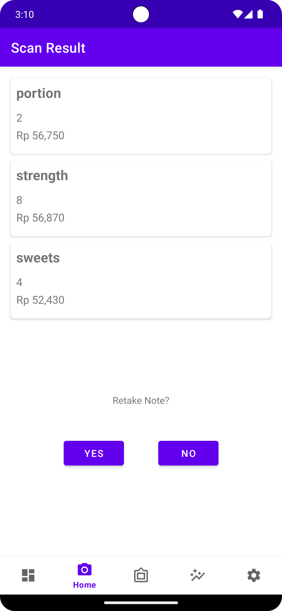                                                                             |
| Twibbon            | 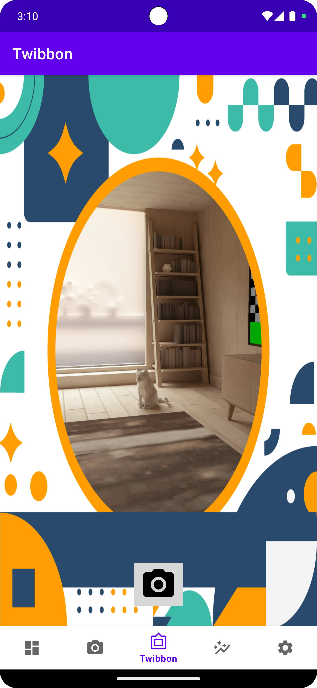                                                                                | 
| Graph              | 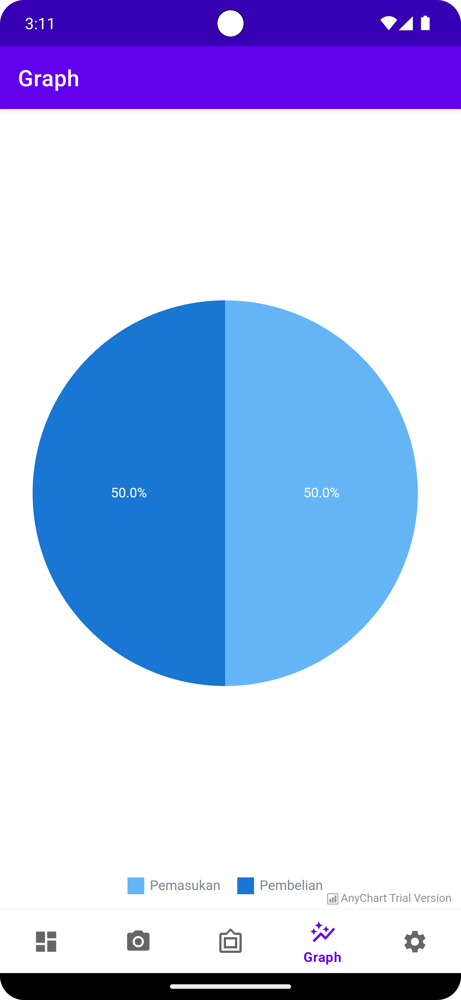 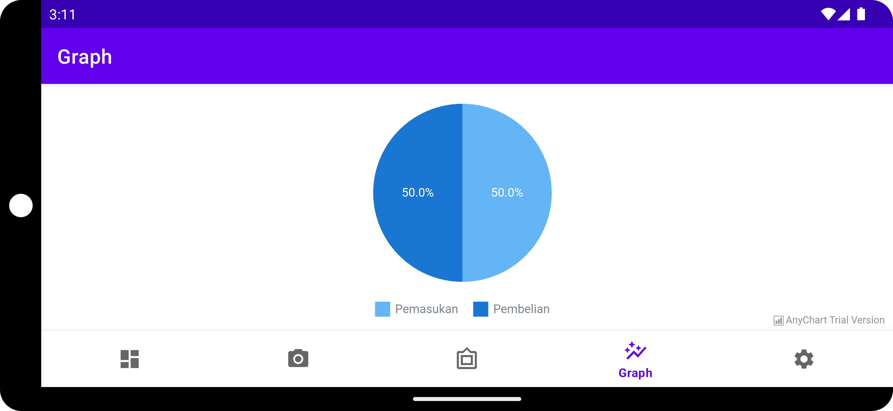 |
| Settings           | 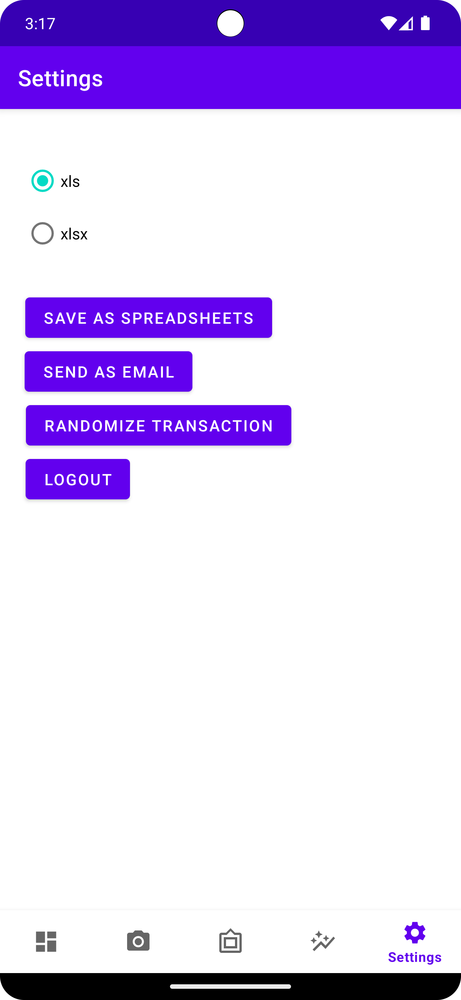                                                                             |
| Network Sensing    | 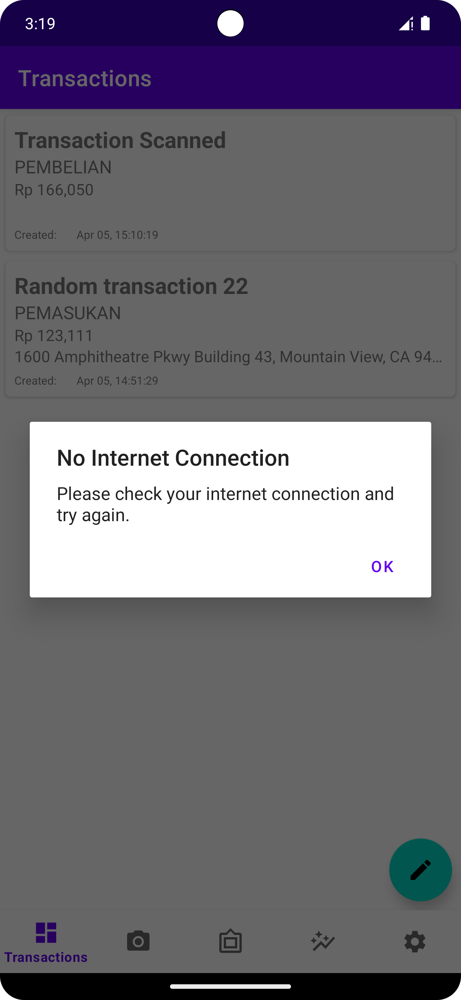                                                                    |

## 🕹️ Library

* room
* retrofit2
* Moshi
* dotenv
* cameraX
* okhttp3
* Apache POI

## 💻 Developers

| Name                                              | Features                                                                         | Exploration hours | Working Hours |
|---------------------------------------------------|----------------------------------------------------------------------------------|-------------------|---------------|
| [Yudi Kurniawan](https://github.com/frankiehuangg)| Login                                                                            |                   |               |
| [Wilson Tansil](https://github.com/Tansil011019)  | Login; Logout; JWT Service; Graph; Network Sensing; Twibbon                      | 5                 | 20            |
| [Farizki Kurniawan](https://github.com/farizkik)  | Header and Navbar; Transaction CRUD; Transaction List; Broadcast Receiver        | 5                 | 20            |
| [Frankie Huang](https://github.com/frankiehuangg) | Note Scanning; Export Transaction to Spreadsheets; Send Transaction with Gmail   | 8                 | 8             |
